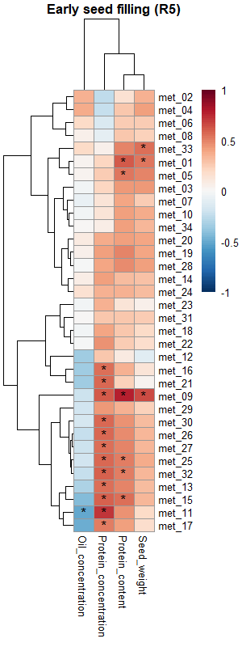
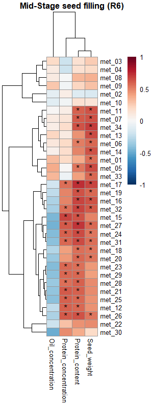

## Biological background

Phloem-delivered metabolites were measured in six contrasting soybean genotypes at two developmental stages (R5 and R6). Pearson correlations were calculated between phloem metabolite levels and final seed composition (protein content, protein concentration, oil concentration, seed weight).

## Results

### Early seed filling (R5)

```{r}

library(tinytex)
#| echo: false
#| message: false
#| warning: false
library(tidyverse)
top_R5 <- read.csv("outputs/tables/top_correlations_R5.csv")
knitr::kable(top_R5)
```

{fig-align="center"}

\_\_\_\_\_\_\_\_\_\_\_\_\_\_\_\_

### Mid-Stage seed filling (R6)

```{r}
#| echo: false
#| message: false
#| warning: false
library(tidyverse)
top_R6 <- read.csv("outputs/tables/top_correlations_R6.csv")
knitr::kable(top_R6)
```

{fig-align="center"}
